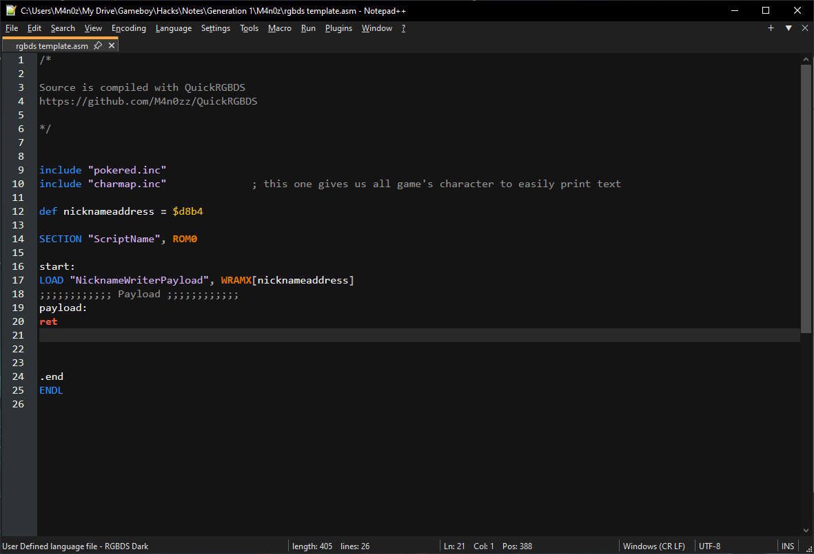
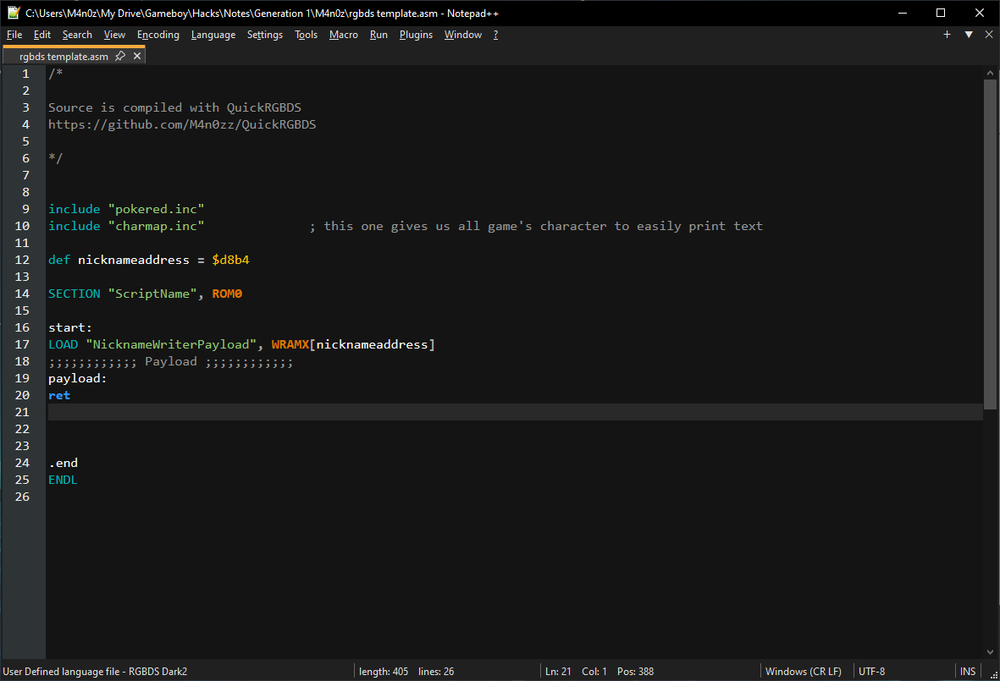

# Notepad++ RGBDS themes

  
   

## Features

- Z80 ASM themes
- Transparent on different background colors
- Twilight theme is recommented when a dark one is used in Settings -> Style configurator...

## Import

1. Language -> User Defined Language -> Define your language...
2. Import
3. Restart Npp

4. Language -> (RGBDS ASM ...)

